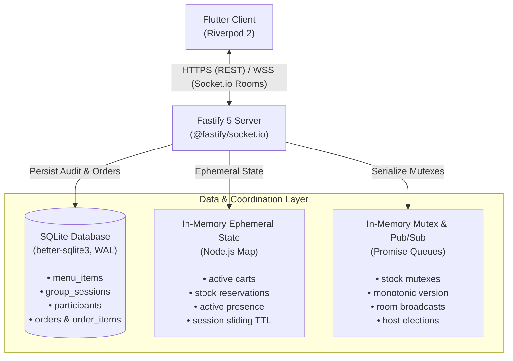

# inMinutes Collaborative Food Ordering

Real-time group food ordering platform built with a Node.js Fastify backend, SQLite persistence, Socket.io rooms, and a Flutter frontend using Riverpod.

The application supports solo ordering and collaborative group orders. In a group order, multiple users join a shared cart through a six-character join code, update items concurrently, view per-user attribution badges, and check out when all participants mark themselves ready.

## Demo / Sync Explanation Video (~8 min)

[Watch on YouTube (unlisted): architecture + frontend/backend code walkthrough + solo and group order demo](https://youtu.be/_xs7uZ2mvCo)

The video covers how the sync logic is architected (in-memory atomic stock reservation, OCC with `baseVersion`, Socket.io room broadcasts, all-ready gate), walks through the key frontend and backend code, and demos a single-user order and a multi-tab group order.

## Live Deployment

- **Backend (Fly.io):** `https://inminutes-takehome.fly.dev` — health probe: `GET /health` → `{ ok: true }`.
- The Flutter app defaults to this URL (see `frontend/lib/config.dart`), so the submitted APK works without running a local backend. Note: Fly.io free-tier machines sleep when idle, so the first request after inactivity can take ~10s to wake.
- For local development, override with `--dart-define=API_BASE_URL=http://localhost:3000` (web) or `http://10.0.2.2:3000` (Android emulator).

---

## Architecture

### System Topology



### Data Division

1. **SQLite (WAL Mode)**: Serves as the durable source of truth. Stores the menu catalog, session audit logs, participant records, placed orders, and item attribution (`order_items.added_by`).
2. **In-Memory State**: Manages high-frequency updates within the active Node.js process. Tracks live cart contents, pending stock reservations, connection counts, and version counters without database write bottlenecks.
3. **Socket.io Rooms**: Routes bidirectional messaging. Each group session maps to a dedicated Socket.io room (`sessionId`). Broadcasts state changes to room members after atomic operations complete.

---

## Core Synchronization Invariants

### Per-User Cart Lines (Ownership)
Every cart line uses the composite key `itemId:addedBy`. When two participants add the same menu item, the cart stores two distinct lines rather than merging quantities.
- Participants can only increment, decrement, or remove their own lines.
- Stepper controls render only on lines you own. Other participants' lines display a static count alongside an attribution badge.
- The server extracts `addedBy` directly from `socket.data.userId`. Clients cannot forge ownership or mutate lines belonging to other participants.

### In-Memory Atomic Stock Reservation
The server protects inventory by using serialized promise queues:
- An in-memory mutex queue keyed by `sessionId` and `itemId` serializes concurrent cart mutations.
- `reserveStock` verifies free inventory (`stock - reserved >= requestedQty`) before confirming a reservation.
- Decrementing item quantity or removing a cart line releases reserved stock immediately.
- Completed checkouts convert active reservations into permanent inventory deductions in SQLite within a database transaction.

### Optimistic Concurrency Control (OCC)
Mutations carry a `baseVersion` integer tracking the client's last observed cart state:
- If `baseVersion` matches the current server version, the mutation applies, the server increments the version counter, and it broadcasts `cart:sync` to all room members.
- If `baseVersion` is stale, the server rejects the write with error code `VERSION_CONFLICT` and attaches `currentState`.
- The client receives the current state, merges differences while preserving UI scroll position, and retries the pending mutation once.

### All-Ready Gate and Host-Only Checkout
1. Participants toggle their status between "Ready" and "Still Browsing" via the `user:ready` event.
2. The server re-evaluates room readiness on each toggle (`participants.every(p => p.ready === true)`).
3. The checkout action remains restricted to `session.hostId`.
4. If a guest calls checkout, the server rejects the request with `ONLY_HOST_CAN_CHECKOUT`.
5. If the host calls checkout before every participant is ready, the server rejects the request with `NOT_ALL_READY`.

### Host Transfer on Disconnect
If the session host leaves or disconnects:
1. The server identifies the connected participant with the earliest `joined_at` timestamp.
2. The server promotes that participant to the new host, updating both in-memory state and SQLite audit records.
3. The server broadcasts `host:changed` with `hostId` and `previousHostId`, updating participant badges and enabling checkout permissions on the promoted client.

### Sliding 30-Minute Idle Session Expiry
Sessions use a sliding inactivity window rather than a static lifetime:
- Default TTL is 1800 seconds (30 minutes), configurable via `SESSION_TTL_SECONDS`.
- Active operations slide the deadline (`expires_at = now + SESSION_TTL_SECONDS`): joining via REST, joining via Socket.io, mutating cart lines, and toggling ready status.
- Passive operations (`GET /api/sessions/:id/state`) do not extend expiry, preventing background pollers from keeping abandoned sessions alive.
- A background sweep runs every 60 seconds (`SESSION_SWEEP_INTERVAL_MS`). When a session passes its deadline, the server drops in-memory state, marks the database row as `expired`, and emits `session:expired` to active sockets.

### Transport Reconnection and Tab Isolation
- **Automatic Rejoin**: When mobile devices drop network coverage or switch between networks, the Flutter client catches the Socket.io `reconnect` signal. It re-emits `session:join` using cached credentials, receiving a full state snapshot without requiring a manual route refresh.
- **Tab Isolation on Web**: The web client uses HTML5 `sessionStorage` for session credentials. Each browser tab retains its own user identity. You can run host and guest sessions side by side in the same browser window for testing without identity collisions.

---

## Tech Stack

| Layer | Technology | Version (tested) | Justification |
|---|---|---|---|
| **Backend Runtime** | Node.js | `v22.18.0` (>= 20.0.0 required) | Native test runner, ESM and CJS compatibility, LTS stability. |
| **Package Manager** | npm | `10.9.3` (>= 10 required) | Lockfile reproducibility for backend deps. |
| **Backend Framework** | Fastify | ^5.12.3 | Low overhead, native schema validation hooks, fast request throughput. |
| **CORS** | @fastify/cors | ^11.3.0 | Allow web frontend (`localhost:8080`/deployed origin) to call REST + Socket.io during local multi-tab testing. |
| **Real-Time Transport** | Socket.io (server) | ^4.8.3 | Room multiplexing (`sessionId` rooms), heartbeat timeouts, automatic transport fallback. |
| **Real-Time Client** | socket_io_client (Flutter) / socket.io-client (Node dev) | ^3.1.6 / ^4.8.3 | Same room/reconnect protocol on mobile and in backend integration tests. |
| **Database** | SQLite via `better-sqlite3` | ^13.0.3 | Synchronous file-based queries, WAL mode concurrency, zero network latency. |
| **Validation** | Zod | ^4.6.1 | Type-safe schema validation for REST payloads and socket messages. |
| **IDs** | nanoid | ^6.0.1 | Collision-resistant session/user IDs and 6-char join codes. |
| **Env Config** | dotenv | ^17.4.2 | `PORT`, `FRONTEND_URL`, `SESSION_TTL_SECONDS` without hardcoding. |
| **Mobile Framework** | Flutter / Dart | `3.27.1` / `3.6.0` (requires Flutter >= 3.27 / Dart ^3.6.0) | Cross-platform compilation, responsive layouts, declarative UI. |
| **State Management** | Riverpod (flutter_riverpod) | ^2.6.1 | Compile-safe state graphs, auto-disposal, fine-grained selector rebuilds to avoid scroll-jank on `cart:sync`. |
| **Navigation** | GoRouter | ^16.1.0 | Declarative URL-based routing, deep link handling, scoped navigation state. |
| **REST Client** | http | ^1.6.0 | Simple typed calls for `/api/menu` and `/api/sessions/*`. |
| **Images** | cached_network_image | ^3.4.1 | Disk/memory caching for menu images so live cart rebuilds don't refetch. |
| **Models** | freezed_annotation + json_annotation (+ freezed/json_serializable dev) | ^3.1.0 / ^4.9.0 | Immutable session/cart models with codegen serialization. |
| **Icons** | cupertino_icons | ^1.0.8 | iOS-style icons dependency required by Flutter template. |
| **Build** | Android Gradle Plugin / Gradle / Java | `8.2.1` / `8.3` / Java 21 (Android Studio JBR) | Must be AGP >= 8.2.1: older AGP fails on Java 21+ with `JdkImageTransform/jlink` error in `:path_provider_android`. |

---

## Project Structure

```
.
├── backend/
│   ├── cart.js            # In-memory cart store, OCC version checking, line mutation logic
│   ├── checkout.js        # Checkout execution, stock confirmation, order insertion
│   ├── db.js              # SQLite database schema, WAL configuration, seed data
│   ├── errors.js          # Canonical error codes and emission helpers
│   ├── expiry.js          # Sliding TTL calculation, session touching, sweep intervals
│   ├── package.json       # Backend dependencies and test scripts
│   ├── participants.js    # Participant lists, presence tracking, host election
│   ├── server.js          # Fastify routes, Socket.io event dispatchers, lifecycle hooks
│   └── stock.js           # Mutex queues, reservation logic, inventory cache
├── context/
│   ├── architecture/      # Decision records covering OCC, ownership, TTL, and reconnects
│   ├── build_plan.md      # Phased implementation schedule
│   ├── PRD.md             # Product requirements and system invariants
│   └── style_guide.md     # Design tokens and visual styling guidelines
├── frontend/
│   ├── lib/
│   │   ├── config.dart             # Environment resolution (web, emulator, LAN)
│   │   ├── main.dart               # Application entry point and theme injection
│   │   ├── router.dart             # Riverpod-managed GoRouter configuration
│   │   ├── theme.dart              # Monochrome palette with Stripe Purple accent
│   │   ├── data/services/          # API client, Socket client, per-tab session storage
│   │   ├── providers/              # Cart, session, participant, and checkout providers
│   │   └── ui/screens/             # Home, Menu, Cart, Join, Group Cart, Order Success
│   ├── test/                       # Flutter unit and widget test files
│   └── pubspec.yaml                # Flutter dependencies and asset declarations
├── tests/                          # Automated backend integration and protocol test suites
└── inminutes_jd.txt                # Internship role reference
```

---

## API and Real-Time Protocol

### REST Endpoints

| Method | Endpoint | Description | Response / Status |
|---|---|---|---|
| `GET` | `/health` | Server health probe | `{ ok: true }` |
| `GET` | `/api/menu` | List catalog items with live stock counts | `[ { id, name, price_paise, stock, category, image_url } ]` |
| `POST` | `/api/sessions` | Create a new group session | `{ sessionId, joinCode, hostId }` |
| `POST` | `/api/sessions/join` | Join existing group session via code | `{ sessionId, userId, isHost }` |
| `GET` | `/api/sessions/:id/state`| Fetch snapshot of session, cart, and users | `{ session, cart, participants, version }` |

### Socket.io Events

#### Client to Server
- `session:join` `{ sessionId, userId, name }`: Joins the socket room and retrieves current room state.
- `session:leave` `{ sessionId }`: Leaves the group room and triggers host re-election if the user was host.
- `cart:add` `{ itemId, qty, baseVersion }`: Adds item to the caller's personal cart line.
- `cart:updateQty` `{ itemId, qty, baseVersion }`: Updates quantity on caller's personal cart line.
- `cart:remove` `{ itemId, baseVersion }`: Removes caller's personal cart line and releases reservations.
- `user:ready` `{ ready: boolean }`: Updates participant ready state.
- `checkout` `{}`: Initiates order placement (host only, requires all members ready).

#### Server to Client
- `cart:sync` `{ version, cart }`: Emitted to room on every accepted cart mutation.
- `participants:sync` `[ { userId, name, ready, isHost } ]`: Broadcast on join, leave, ready, or host change.
- `checkout:available` `{ available: boolean }`: Broadcast when all-ready state changes.
- `host:changed` `{ hostId, previousHostId }`: Broadcast when host role passes to another participant.
- `session:checkout` `{ orderId }`: Broadcast to all room members upon successful order creation.
- `session:expired` `{ sessionId }`: Broadcast to room members when a session reaches idle deadline.
- `error` `{ code, message, ... }`: Targeted error emission for rejected operations.

### Protocol Error Codes

| Code | Cause | Client Resolution |
|---|---|---|
| `VERSION_CONFLICT` | Stale `baseVersion` on mutation | Apply returned `currentState` and retry operation. |
| `OUT_OF_STOCK` | Free inventory is less than requested quantity | Disable add button; display remaining count. |
| `ONLY_HOST_CAN_CHECKOUT` | Non-host socket sent `checkout` event | Keep checkout button disabled for guests. |
| `NOT_ALL_READY` | Host clicked checkout while participants are browsing | Highlight unready participants in the list. |
| `SESSION_EXPIRED` | Session passed 30-minute idle threshold | Clear session storage and route user home. |
| `SESSION_COMPLETED` | Mutation sent to an already checked-out order | Route user to order confirmation view. |

---

## Setup and Running

### Prerequisites
- Node.js `v22.18.0` (requires >= 20.0.0)
- npm `10.9.3` (requires >= 10)
- Flutter `3.27.1` / Dart `3.6.0` (requires Flutter >= 3.27 / Dart ^3.6.0) — verify with `flutter --version`
- For APK builds: JDK 17+ and Android SDK with `android-35` platform (repo uses AGP `8.2.1` + Gradle `8.3`, verified with Android Studio JBR Java 21 — see [Building the APK](#building-the-apk))

### 1. Backend Service

Navigate to the `backend` directory, install dependencies, and start the development server:

```bash
cd backend
npm install
npm start
```

The server listens on `http://localhost:3000`. It initializes SQLite in WAL mode and populates the database with sample menu items if no database file exists.

Configure options in `backend/.env`:

```env
PORT=3000
FRONTEND_URL=http://localhost:8080
SESSION_TTL_SECONDS=1800
SESSION_SWEEP_INTERVAL_MS=60000
```

> [!TIP]
> Use `npm run dev` in `backend` to run the server with Node's native file watcher enabled (`node --watch server.js`).

### 2. Frontend Application

Navigate to the `frontend` directory and install Flutter packages:

```bash
cd frontend
flutter pub get
```

#### Run on Web (Recommended for Multi-User Testing)

```bash
flutter run -d chrome
```

To test group ordering locally:
1. Open the app in your primary browser window.
2. Click **Start Group Order**, enter your name, and copy the 6-character join code.
3. Open a second tab in the same browser.
4. Click **Join Group Order**, enter the join code, and input a distinct name.
5. Add items from both tabs. You will observe separate cart lines with distinct attribution badges.
6. Toggle "Ready" in both tabs.
7. Click **Place Order** from the host tab. Both tabs navigate to the order confirmation screen.

> [!NOTE]
> Web builds use browser `sessionStorage`. Each tab maintains an isolated user session, allowing host and guest testing without opening incognito windows.

#### Run on Android Emulator

Ensure an Android emulator is running, then execute:

```bash
flutter run -d android
```

The app connects to the backend host through `http://10.0.2.2:3000`.

#### Run with Custom Network Endpoint

To connect physical devices on your local Wi-Fi:

```bash
flutter run --dart-define=API_BASE_URL=http://<YOUR_LOCAL_IP>:3000
```

### Building the APK

The submitted APK is pre-configured to hit the Fly.io backend, so reviewers don't need a local server. `frontend/lib/config.dart` defaults to `https://inminutes-takehome.fly.dev`; pass `--dart-define` explicitly to be safe.

```powershell
# From repo root: wake backend first (cold start ~10s)
curl https://inminutes-takehome.fly.dev/health

cd frontend
flutter pub get

# IMPORTANT: repo must use AGP >= 8.2.1 (see `frontend/android/settings.gradle`).
# Older AGP 8.1.0 fails on Java 21+ with `JdkImageTransform ... jlink.exe` /
# `:path_provider_android:compileReleaseJavaWithJavac`. Fixed by bumping AGP 8.1.0 → 8.2.1.
flutter build apk --debug --dart-define=API_BASE_URL=https://inminutes-takehome.fly.dev
# Output: build/app/outputs/flutter-apk/app-debug.apk
```

Use `--debug` for submission (allowed: "debug or release build for testing"). For a smaller artifact, replace `--debug` with `--release` (release is signed with debug keys in `android/app/build.gradle`, so it installs without a Play Store keystore). Rename e.g. to `inminutes-debug.apk` before emailing. If Gmail blocks the attachment, share a Drive link.

---

## Automated Test Suites

### Backend Tests (Node Test Runner)

The backend test suite covers database schemas, REST endpoints, stock reservations, cart OCC, socket events, host transfers, sliding TTL, and transport reconnects:

```bash
cd backend
npm test
```

This command runs 44 automated tests across 10 test suites:
- `tests/db.test.js`: SQLite table creation, constraints, and seeding.
- `tests/api.test.js`: REST health, menu retrieval, session creation, and state retrieval.
- `tests/stock.test.js`: In-memory stock reservations, free inventory tracking, and concurrent mutex locks.
- `tests/cart.test.js`: OCC version checks, ownership keys, line additions, and deletions.
- `tests/realtime.test.js`: Dual-client socket connections and conflict resolution.
- `tests/checkout.test.js`: All-ready gate enforcement, host permissions, and order persistence.
- `tests/session_lifecycle.test.js`: Disconnection transfers, explicit leave events, and TTL sweeps.
- `tests/session_ttl_touch.test.js`: Sliding idle deadlines and read-query touch protection.
- `tests/reconnect.test.js`: Simulated network drops, reconnect replay, and offline conflict healing.
- `tests/phase4.verify.test.js`: End-to-end host migration and cleanup checks.

### Frontend Tests (Flutter Test Runner)

Run the unit and widget tests for session persistence and UI components:

```bash
cd frontend
flutter test
```

The suite verifies JSON state serialization, cross-platform session storage adapters, and home screen rendering.

---

## Assumptions and Constraints

1. **Authentication Scope**: Users join sessions using temporary display names and six-character join codes. The system does not maintain permanent user accounts or passwords.
2. **Single Kitchen**: The menu catalog assumes one central fulfillment center. It does not handle multi-vendor carts or split kitchen dispatching.
3. **Single Backend Instance**: The current architecture uses in-process Node.js mutex queues and SQLite WAL mode for concurrency control. Horizontal scaling across multiple nodes requires an external coordinator such as Redis with Lua scripts.
4. **Mocked Payments**: Checking out confirms the order and creates database records directly. Payment gateways and transaction settlements are out of scope.
5. **Network Connectivity**: Real-time synchronization requires an active WebSocket connection. The app buffers mutations during transient reconnects, but it does not support full offline operation.
